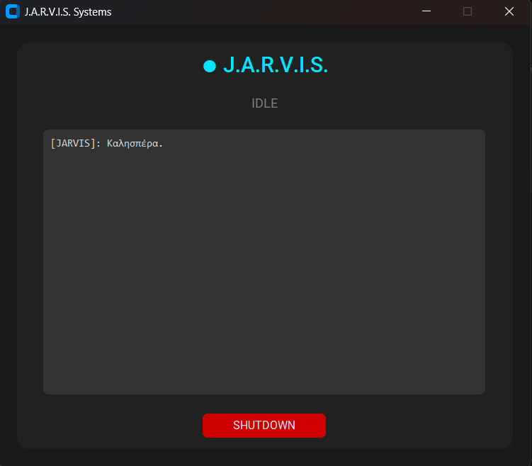
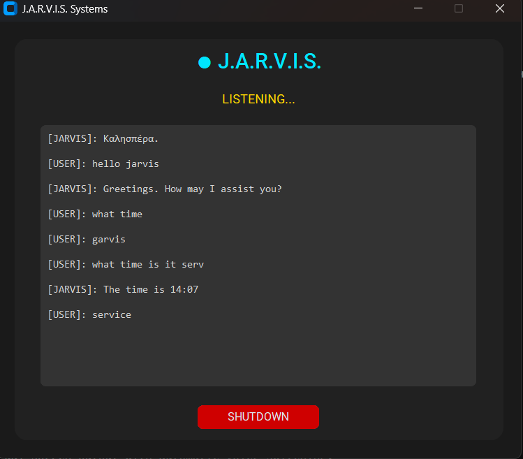

# G.R.A.V.I.S. Voice Assistant

[](https://www.python.org/)
[](https://www.microsoft.com/windows)
[](https://ai.google.dev/)

G.R.A.V.I.S. is a desktop AI assistant built with Python for English and Greek voice interaction.
It combines wake-word commands, local system actions, and Gemini AI responses in a single GUI app.

## Demo


## Screenshots




## Features

- Wake-word activation: Gravis / Greek variants.
- Bilingual speech recognition (`el-GR`, `en-US`).
- Bilingual text-to-speech with automatic voice selection.
- Gemini AI integration (`gemini-2.5-flash`) for fallback answers.
- GUI with live status and command log.
- Built-in commands for:
  - web search and Wikipedia
  - opening apps/sites
  - YouTube playback
  - notes
  - screenshots
  - camera scene description
  - system status (CPU/RAM/battery)
  - recycle bin cleanup
  - shutdown scheduling
  - sleep/wake listening modes

## Project Structure

- `jarvis.py`: Main application (GUI, voice, command routing, AI fallback).
- `check.py`: Quick Gemini model/API test script.
- `gemini_api_key`: Local API key file (optional fallback if env var is missing).
- `assets/`: Demo and screenshots.

## Quick Start (Windows)

1. Install Python 3.10+ from python.org.
2. Make sure `tcl/tk and IDLE` is installed (required by `customtkinter`).
3. Install dependencies:

```powershell
py -m pip install -r requirements.txt
```

4. Add your Gemini API key:
- Option A: set environment variable `GEMINI_API_KEY`
- Option B: create/update `gemini_api_key` with your key in one line

5. Verify AI connectivity:

```powershell
py check.py
```

6. Run the assistant:

```powershell
py jarvis.py
```

## Example Voice Commands

English:
- "Gravis, help"
- "Gravis, open youtube.com"
- "Gravis, play Linkin Park Numb"
- "Gravis, what time is it"
- "Gravis, system status"

Greek:
- "Γκράβις βοήθεια"
- "Γκράβις άνοιξε youtube.com"
- "Γκράβις παίξε Imagine Dragons"
- "Γκράβις τι ώρα είναι"
- "Γκράβις κατάσταση συστήματος"

## Troubleshooting

- `ModuleNotFoundError: No module named 'tkinter'`
  - Re-run Python installer and enable `tcl/tk and IDLE`.

- `ModuleNotFoundError: No module named 'win32con'`
  - Install/repair pywin32:

```powershell
py -m pip install pywin32
```

- AI does not answer
  - Check `GEMINI_API_KEY` or `gemini_api_key` file.
  - Run `py check.py` to validate model access.

- Microphone not detected
  - Check Windows microphone privacy permissions.

## Security

- Do not commit real API keys.
- `.gitignore` already excludes `gemini_api_key`, `.env`, and common local artifacts.

## Notes

- Current implementation is Windows-oriented for several system commands.
- If you want Linux/macOS support, add platform-specific command handlers.
